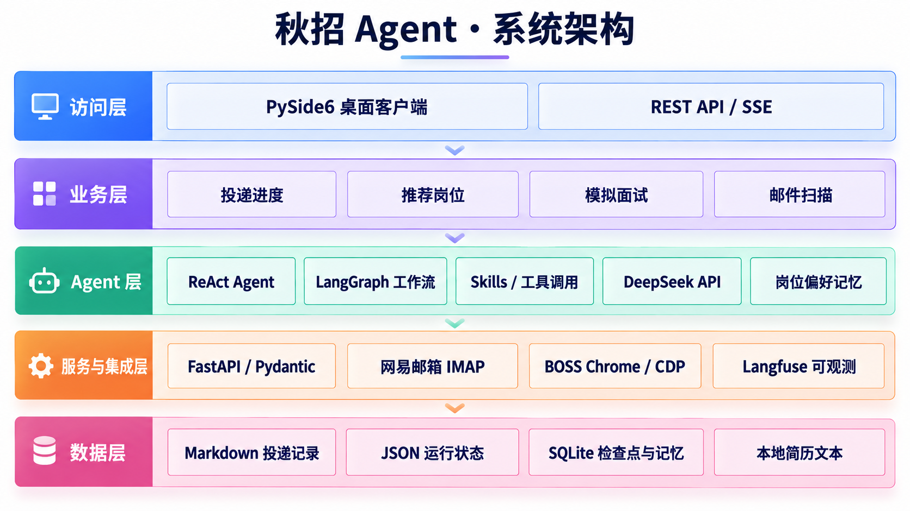

# Interview Assistant

Interview Assistant 是一个面向个人秋招管理的桌面 Agent。它把投递进度、招聘邮件、岗位推荐和模拟面试集中到一个客户端中，并允许通过自然语言查询、添加或修改投递记录。

> 项目默认只监听本机地址，适合作为个人工具运行。BOSS 直聘功能只读取岗位并给出推荐，不会自动投递。

## 核心功能

| 功能 | 说明 |
|---|---|
| Agent 对话 | 根据当前页面调用对应工具，支持流式输出和 Markdown 展示 |
| 投递管理 | 分页查询、筛选和直接编辑公司、岗位、Base、状态及笔试/面试起止时间 |
| 邮件扫描 | 扫描网易邮箱中的未读、已读或全部邮件，提取笔试、面试、Offer 和拒信信息 |
| 岗位推荐 | 从 BOSS 直聘读取真实岗位，按照技术栈、业务方向和 Base 地给出匹配度 |
| 模拟面试 | 上传 PDF/DOCX 简历，根据技术栈和项目逐题提问，并生成面试总结 |

系统支持以下投递状态：

```text
已投递、简历筛选中、笔试中、待面试、一面、二面、三面、HR面、Offer、已结束
```

- `已投递`：简历已经投出，但尚未收到笔试或面试邀请。
- `待面试`：已经收到面试邀请，但面试尚未进行，是正常业务状态。

## 系统架构



### 技术栈

| 模块 | 技术 |
|---|---|
| 桌面客户端 | Python、PySide6、httpx |
| 服务端 | Python、FastAPI、Pydantic |
| Agent | LangGraph、ReAct、OpenAI 兼容协议、DeepSeek API |
| Agent 可观测性 | Langfuse（可选，默认关闭） |
| 投递记录 | 本地 Markdown |
| 运行状态 | 本地 JSON |
| Agent 检查点 | SQLite |
| 外部接入 | 网易邮箱 IMAP、Playwright、BOSS 直聘 |

## 项目结构

```text
InterviewAssistant/
├─ frontend/                 # PySide6 客户端及前端测试
├─ backend/
│  ├─ app/                   # FastAPI、Agent、业务服务及外部连接器
│  ├─ data/                  # 本地业务数据，不提交 Git
│  ├─ tests/                 # 后端测试
│  └─ .env.example           # 配置模板，不包含密钥
├─ scripts/                  # 启动、接入检查和冒烟测试脚本
├─ start.bat                 # 一键启动前后端
├─ start-boss-login.bat      # 初始化 BOSS 专用浏览器登录态
├─ CLIENT_DESIGN.md          # 客户端设计
└─ SERVER_DESIGN.md          # 服务端、Agent 和接口设计
```

## 环境要求

- Windows 10/11
- Python 3.11 或 3.12
- Microsoft Edge（岗位读取使用）
- DeepSeek API Key（使用 Agent 时需要）
- 已开启 IMAP 的网易邮箱及客户端授权码（使用邮件扫描时需要）

网易邮箱和 BOSS 均为可选接入；未配置时不影响投递表格等基础功能。

## 安装

在项目根目录执行：

```bat
python -m venv .venv
.venv\Scripts\python.exe -m pip install --upgrade pip
.venv\Scripts\python.exe -m pip install -r requirements.txt
copy backend\.env.example backend\.env
```

## 配置

在 `backend/.env` 中填写 DeepSeek 配置：

```dotenv
DEEPSEEK_API_KEY=
DEEPSEEK_BASE_URL=https://api.deepseek.com
DEEPSEEK_MODEL=deepseek-flash
AGENT_MODEL_NAME=interview-assistant
```

请将 API Key 只保存在本地 `backend/.env` 中，不要写入代码或 `.env.example`。客户端只访问本地 Agent 服务，服务端提供 OpenAI 兼容接口：

- `POST /v1/chat/completions`
- `GET /v1/models`

### Langfuse（可选）

在 Langfuse Cloud 或自托管实例中创建项目后，进入该项目的 **Settings → API Keys** 创建项目密钥。把密钥写入本地 `backend/.env`，`LANGFUSE_BASE_URL` 使用当前 Langfuse 站点地址（自托管时填写实例地址）：

```dotenv
LANGFUSE_ENABLED=true
LANGFUSE_PUBLIC_KEY=pk-lf-...
LANGFUSE_SECRET_KEY=sk-lf-...
LANGFUSE_BASE_URL=https://cloud.langfuse.com
LANGFUSE_TRACING_ENVIRONMENT=development
LANGFUSE_SAMPLE_RATE=1.0
LANGFUSE_CAPTURE_CONTENT=false
```

服务端使用 Langfuse 官方 OpenAI 包装器观测 DeepSeek：每轮聊天是一条 Agent trace，每次模型请求是一条 generation，工具调用和 LangGraph 节点保留父子层级；`conversation_id` 会作为 session ID 聚合同一会话。包装器自动记录流式首 token 延迟、模型、token 用量、异常，以及 Langfuse 能识别模型定价时的成本。

默认只发送字段名、数量、状态和耗时等摘要，因此平台中看不到对话正文；只有明确设置 `LANGFUSE_CAPTURE_CONTENT=true` 才发送受限的对话与工具内容。无论该开关如何，名称含 `token`、`secret`、`password`、`cookie`、`authorization`、`api_key` 或 `auth_code` 的字段都会被替换为 `[redacted]`。Langfuse 未配置、不可用或上报失败均不影响主业务。

### 网易邮箱

在网易邮箱中开启 IMAP，生成客户端授权码，然后配置：

```dotenv
NETEASE_IMAP_HOST=imap.163.com
NETEASE_IMAP_PORT=993
NETEASE_EMAIL=
NETEASE_EMAIL_AUTH_CODE=
```

126 邮箱将 `NETEASE_IMAP_HOST` 改为 `imap.126.com`。这里填写客户端授权码，不是邮箱登录密码。邮件正文只在本次扫描内存中用于提取，不落盘；成功处理后只在 `runtime.json` 保存邮件标识和处理结果。

### BOSS 直聘

双击 `start-boss-login.bat`，在打开的专用 Edge 窗口中手动登录并完成网站验证。看到岗位列表后返回终端按回车，程序会保存本地浏览器登录态。

随后进入客户端的“推荐岗位”页面，点击“重新匹配”。项目不会绕过网站验证，也不会自动投递岗位。

## 本地数据

| 文件 | 内容 |
|---|---|
| `backend/data/interviews.md` | 投递记录，可直接用文本编辑器查看 |
| `backend/data/runtime.json` | 邮件去重、异步任务、岗位缓存和模拟面试会话 |
| `backend/data/resumes/*.txt` | 从 PDF/DOCX 简历解析出的本地纯文本；不提交到 Git |
| `backend/data/langgraph.sqlite3` | LangGraph 对话检查点 |

这些文件首次运行时自动创建，均已加入 `.gitignore`。修改 `interviews.md` 时请保留表头和列数，并在服务停止后编辑。

## 启动

在 Windows 终端进入项目根目录后执行：

```bat
start.bat
```

脚本会检查虚拟环境，在 `127.0.0.1:8000` 启动 FastAPI，等待健康检查通过后打开 PySide6 客户端；客户端退出后，会关闭本次启动的服务端。

- 健康检查：<http://127.0.0.1:8000/api/health>
- OpenAPI 文档：<http://127.0.0.1:8000/docs>

## 接入检查

只读检查网易邮箱，不标记邮件已读，也不会调用付费模型：

```bat
.venv\Scripts\python.exe -m scripts.check_integrations
```

额外检查 BOSS 公开页面：

```bat
.venv\Scripts\python.exe -m scripts.check_integrations --boss
```

## 测试

```bat
.venv\Scripts\python.exe -m unittest discover -s backend\tests
cd frontend
..\.venv\Scripts\python.exe -m unittest discover -s tests
```

## 数据与安全

以下内容已由 `.gitignore` 排除，不应上传到 GitHub：

- `backend/.env` 和 API Key；
- 网易邮箱账号与授权码；
- `backend/data` 下的个人投递数据和 Agent 状态；
- BOSS 浏览器登录态、Cookie 和缓存；
- Python 虚拟环境、日志和缓存文件。

请勿使用 `git add -f backend/.env` 或强制添加 `backend/data` 中的个人文件。

## 设计文档

- [客户端设计](CLIENT_DESIGN.md)
- [服务端、Agent 与接口设计](SERVER_DESIGN.md)
- [后端运行说明](backend/README.md)
