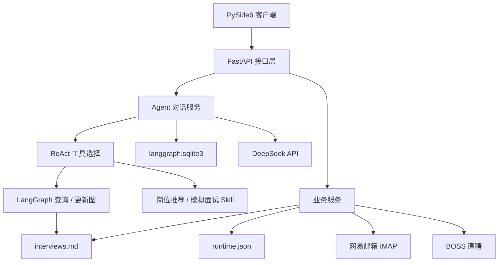

# Interview Assistant 服务端设计

## 业务功能

Interview Assistant 是一个本地运行的个人秋招助手。它维护投递记录，从招聘邮件中识别进展，推荐值得投递的岗位，并通过对话和模拟面试协助用户准备秋招。

| 功能 | 实现方式 | 说明 |
|---|---|---|
| 对话 | ReAct | 识别当前页面和用户意图，选择对应工具 |
| 查询投递状态 | LangGraph | 查询本地 Markdown，返回筛选结果和统计 |
| 更新投递状态 | LangGraph | 校验并原子写入本地 Markdown |
| 推荐岗位 | Skill + ReAct | 搜索真实岗位、分析 JD 并返回匹配度和链接 |
| 模拟面试 | Skill + ReAct | 按回答动态追问并生成评价 |
| 邮件处理 | 服务编排 | 扫描邮箱、提取招聘事件并更新唯一匹配记录 |

## 技术栈

| 模块 | 技术 |
|---|---|
| 服务端 | Python、FastAPI、Pydantic |
| Agent | LangGraph、ReAct、OpenAI Chat Completions 兼容协议 |
| 模型 | DeepSeek API |
| 投递记录 | Markdown |
| 运行状态 | JSON |
| LangGraph 检查点 | SQLite |
| 邮箱 | IMAP |
| 岗位采集 | Playwright、BOSS 直聘 |

## 系统架构图



## Agent 设计

### Agent 工具

| 工具 | 作用 |
|---|---|
| `query_interview_status` | 按公司、岗位、状态和分页参数查询投递记录 |
| `create_interview` | 新增投递记录 |
| `update_interview` | 修改公司、岗位、Base、状态、起止时间或岗位链接 |
| `scan_emails` | 扫描未读、已读或全部招聘邮件，并等待任务完成 |
| `get_task_status` | 查询邮件任务状态和人工核对项 |
| `recommend_jobs` | 搜索并评估真实岗位 |
| `start_mock_interview` | 开始模拟面试 |
| `submit_mock_answer` | 评价回答并生成追问或下一题 |
| `finish_mock_interview` | 结束模拟面试并生成总结 |

### LangGraph 图编排

#### 查询投递状态

```text
开始 → 查询本地投递记录 → 结束
```

| 节点 | 功能 |
|---|---|
| 查询本地投递记录 | 校验公司、岗位、状态和分页条件，从 `interviews.md` 返回记录及状态统计 |

#### 更新投递状态

```text
开始 → 校验变更 → 写入本地记录 → 结束
```

| 节点 | 功能 |
|---|---|
| 校验变更 | 确认记录存在、旧状态一致、字段和起止时间合法 |
| 写入本地记录 | 在文件锁内更新 `interviews.md`，通过临时文件替换保证完整写入 |

推荐岗位和模拟面试使用 Skill + ReAct，不进入上述业务图。

### Skills

| Skill | 输入 | 输出 |
|---|---|---|
| 岗位推荐 | 城市、技术栈、业务偏好、关键词、分页参数 | 岗位列表、匹配度、匹配理由、风险点、JD、投递链接 |
| 模拟面试 | 目标公司、岗位、轮次、考察方向、用户回答 | 问题、追问、评分、改进建议和总结 |

## 本地存储

| 文件 | 保存内容 |
|---|---|
| `backend/data/interviews.md` | 公司、岗位、Base、状态、开始时间、结束时间、岗位链接、更新时间 |
| `backend/data/runtime.json` | 邮件处理标识、异步任务、岗位缓存、模拟面试会话和幂等操作记录 |
| `backend/data/langgraph.sqlite3` | LangGraph 检查点及会话工具上下文 |

个人数据文件不提交 Git。邮件正文只在当前扫描内存中使用，不落盘。

## 前后端接口

所有继承 `ExtensibleRequest` 的请求都可以带：

| 参数 | 类型 | 必填 | 含义 |
|---|---|---|---|
| `extensions` | object | 否 | 预留扩展参数 Map，未约定键不影响当前业务 |

### 投递记录

#### `GET /api/interviews`

作用：分页查询投递记录和状态卡片统计。

请求参数：

| 参数 | 位置 | 类型 | 必填 | 含义 |
|---|---|---|---|---|
| `company_name` | query | string | 否 | 公司名称包含匹配 |
| `position_name` | query | string | 否 | 岗位名称包含匹配 |
| `status` | query | string | 否 | 投递状态精确匹配 |
| `page` | query | integer | 否 | 页码，默认 1 |
| `page_size` | query | integer | 否 | 每页数量，1～100 |

输出参数：

| 参数 | 类型 | 含义 |
|---|---|---|
| `items` | array | 当前页投递记录 |
| `items[].id` | integer | 记录 ID |
| `items[].company_name` | string | 公司名称 |
| `items[].position_name` | string | 岗位名称 |
| `items[].base_location` | string | Base 地 |
| `items[].current_status` | string | 当前状态 |
| `items[].interview_time` | string/null | 开始时间 |
| `items[].interview_end_time` | string/null | 结束时间 |
| `items[].job_url` | string/null | 岗位链接 |
| `items[].updated_at` | string | 更新时间 |
| `total` | integer | 筛选结果总数 |
| `page` | integer | 当前页码 |
| `page_size` | integer | 每页数量 |
| `total_pages` | integer | 总页数 |
| `has_previous` | boolean | 是否有上一页 |
| `has_next` | boolean | 是否有下一页 |
| `summary.total` | integer | 文本筛选范围内的全部记录数 |
| `summary.status_counts` | object | 各状态数量 Map |

#### `POST /api/interviews`

作用：新增一条投递记录。

输入参数：

| 参数 | 类型 | 必填 | 含义 |
|---|---|---|---|
| `company_name` | string | 是 | 公司名称 |
| `position_name` | string | 是 | 岗位名称 |
| `base_location` | string | 是 | Base 地 |
| `current_status` | string | 否 | 当前状态，默认简历筛选中 |
| `interview_time` | string/null | 否 | 开始时间，ISO 8601 |
| `interview_end_time` | string/null | 否 | 结束时间，ISO 8601 |
| `job_url` | string/null | 否 | 岗位原始链接 |
| `extensions` | object | 否 | 扩展参数 Map |

输出：新建后的完整投递记录。

#### `PATCH /api/interviews/{interview_id}`

作用：保存表格中一整行可编辑字段。

输入参数：

| 参数 | 类型 | 必填 | 含义 |
|---|---|---|---|
| `interview_id` | integer | 是 | URL 中的记录 ID |
| `company_name` | string | 是 | 公司名称 |
| `position_name` | string | 是 | 岗位名称 |
| `base_location` | string | 是 | Base 地 |
| `current_status` | string | 是 | 当前状态 |
| `interview_time` | string/null | 是 | 开始时间 |
| `interview_end_time` | string/null | 是 | 结束时间 |
| `extensions` | object | 否 | 扩展参数 Map |

输出：保存后的完整投递记录。

#### `PATCH /api/interviews/{interview_id}/status`

作用：只修改状态和可选的开始时间。

输入参数：

| 参数 | 类型 | 必填 | 含义 |
|---|---|---|---|
| `interview_id` | integer | 是 | URL 中的记录 ID |
| `target_status` | string | 是 | 目标状态 |
| `interview_time` | string/null | 否 | 新开始时间 |
| `note` | string/null | 否 | 修改备注 |
| `extensions` | object | 否 | 扩展参数 Map |

输出参数：`id`、`previous_status`、`current_status`、`interview_time`、`updated_at`。

### Agent 对话

#### `POST /v1/chat/completions`

作用：使用 OpenAI Chat Completions 兼容协议发送 Agent 对话。

主要输入参数：

| 参数 | 类型 | 必填 | 含义 |
|---|---|---|---|
| `model` | string | 是 | 本地模型名 `interview-assistant` |
| `messages` | array | 是 | OpenAI 格式消息列表 |
| `stream` | boolean | 否 | 是否使用 SSE 流式输出 |
| `metadata.page_context` | string | 否 | 当前 Tab，例如 `applications`、`jobs`、`mock_interview` |

输出：OpenAI Chat Completion 对象或 SSE 数据流。

### 邮件扫描

#### `POST /api/email/sync`

作用：提交邮件扫描任务。

| 参数 | 类型 | 必填 | 含义 |
|---|---|---|---|
| `limit` | integer | 否 | 扫描上限，默认 50，最大 100 |
| `scope` | string | 否 | `unread`、`read` 或 `all`，默认 `unread` |
| `extensions` | object | 否 | 扩展参数 Map |

输出参数：`task_id`、`status`、`created_at`。

#### `GET /api/tasks/{task_id}`

作用：查询邮件任务进度和结果。

输入：路径参数 `task_id`。输出包含 `status`、`result`、`error`、`created_at`、`updated_at`。

### 岗位推荐

#### `POST /api/job-recommendations`

| 参数 | 类型 | 必填 | 含义 |
|---|---|---|---|
| `cities` | string[] | 否 | 目标城市 |
| `tech_stack` | string[] | 是 | 技术栈 |
| `business_preferences` | string[] | 否 | 业务偏好 |
| `keywords` | string[] | 否 | 搜索关键词 |
| `page` | integer | 否 | 页码 |
| `page_size` | integer | 否 | 每页数量，最大 100 |
| `extensions` | object | 否 | 扩展参数 Map |

输出：推荐批次 ID、分页信息和岗位列表；岗位包含公司、岗位、Base、匹配度、理由、风险、JD 和投递链接。

#### `GET /api/job-recommendations/{recommendation_id}`

作用：读取一条已缓存推荐。输入路径参数 `recommendation_id`，输出完整岗位推荐信息。

### 模拟面试

#### `POST /api/mock-interviews`

| 参数 | 类型 | 必填 | 含义 |
|---|---|---|---|
| `company_name` | string/null | 否 | 目标公司 |
| `position_name` | string | 是 | 目标岗位 |
| `interview_round` | string | 是 | 面试轮次 |
| `interview_focus` | string[] | 否 | 考察方向 |
| `extensions` | object | 否 | 扩展参数 Map |

输出：`session_id`、首个 `question`、`question_id` 和会话状态。

#### `GET /api/mock-interviews/{session_id}`

作用：恢复模拟面试。输入路径参数 `session_id`，输出会话配置、问答记录、当前问题和总结。

#### `POST /api/mock-interviews/{session_id}/answers`

| 参数 | 类型 | 必填 | 含义 |
|---|---|---|---|
| `question_id` | string | 是 | 当前问题 ID |
| `answer` | string | 是 | 用户回答 |
| `extensions` | object | 否 | 扩展参数 Map |

输出：评分、评价、追问或下一题及会话状态。

#### `POST /api/mock-interviews/{session_id}/finish`

作用：结束面试并生成总结。输入可选 `extensions`，输出总体评分、总结、优点、问题和改进建议。
