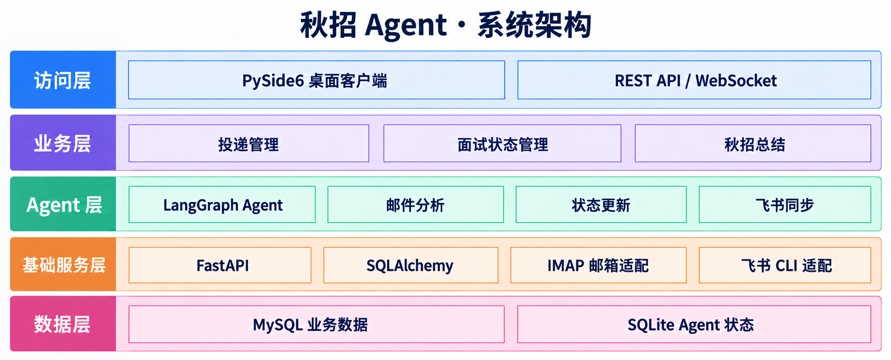

# 秋招 Agent 服务端设计

## 业务功能

秋招 Agent 是一个面向个人秋招管理的桌面智能助手。用户可以通过对话查询和更新面试状态、获取匹配的岗位推荐，并进行模拟面试；系统同时接入网易邮箱和飞书，用于获取招聘通知、维护投递进度和同步秋招总结。

## 技术栈

| 类型 | 技术 |
|---|---|
| 客户端 | Python、PySide6 |
| 服务端 | Python、FastAPI、Uvicorn |
| Agent | LangGraph、LangChain |
| 大模型 | DeepSeek API、OpenAI Python SDK |
| 数据访问 | SQLAlchemy 2.x、Alembic |
| 业务数据库 | MySQL |
| Agent 状态 | SQLite |
| 邮箱接入 | IMAP |
| 飞书接入 | 飞书 CLI |
| 岗位来源 | Playwright、BOSS 已登录页面、BeautifulSoup |
| 服务端通信 | REST API；Agent 使用 OpenAI Chat Completions 协议（JSON / SSE） |
| 配置管理 | Pydantic Settings、`.env` |

## 系统架构图



## Agent 设计

### 功能与实现方式

| 功能 | 适合方式 | 说明 |
|---|---|---|
| 对话 | ReAct | 理解上下文并调用对应能力 |
| 查询面试状态 | LangGraph 图编排 | 读取并合并多个数据源的状态 |
| 更新投递信息 | LangGraph 图编排 | 控制整行字段更新和飞书同步 |
| 推荐岗位 | Skill + ReAct | 搜索岗位并分析岗位匹配度 |
| 模拟面试 | Skill + ReAct | 根据回答动态提问、追问和评价 |

### Agent 工具

- `query_interview_status`：查询公司、岗位、面试阶段和面试时间。
- `create_interview`：添加投递记录。
- `update_interview`：通用记录修改工具；先查询唯一记录，再按需更新公司、岗位、Base、状态、面试时间、岗位链接和备注。
- `scan_emails`：按未读、已读或全部范围扫描网易邮箱，等待处理完成后返回统计结果。
- `get_task_status`：查询邮件扫描进度、结果和需人工核对项。
- `update_feishu_summary`：将最新投递和面试状态同步到飞书。
- `recommend_jobs`：搜索真实岗位，读取 JD 并分析匹配度。
- `start_mock_interview`：创建模拟面试并出题。
- `submit_mock_answer`：评价回答并生成追问或下一题。
- `finish_mock_interview`：结束面试并保存总结。
- `read_interview_experience`：只读取 ZMY 的个人面经。

进度和日期读取是查询图的内部连接器能力。标记已读只在处理记录保存后执行；含糊邮件保留未读。邮件正文不写入 MySQL 或 SQLite。

| 飞书配置 | 对应来源 |
|---|---|
| `FEISHU_InterviewDate_TOKEN` | 笔试/面试日期，多维表格及指定视图 |
| `FEISHU_Progress_TOKEN` | 进度文档内嵌电子表格 |
| `FEISHU_InterviewQuestion_TOKEN` | 个人面经，只读取 ZMY；索引链接自动定位实际面经文档 |

“已投递”表示简历已经投出、尚未收到笔试或面试邀请。“待面试”表示已经收到面试邀请但尚未参加，它是正常业务状态而不是异常；日期表可补充邀请时间，但不会把它擅自改成一面、二面等已参加轮次。

### LangGraph 图编排

ReAct 根据用户意图选择工具、生成参数；查询和更新工具再进入业务图。图节点状态写入 SQLite，业务记录写入 MySQL。

#### 查询面试状态

```text
              ┌→ 查询 MySQL 面试数据 ─┐
结构化查询参数 ┤                       ├→ 合并面试状态 → 结束
              └→ 读取飞书秋招总结 ────┘
```

| 节点 | 功能 |
|---|---|
| 查询 MySQL 面试数据 `query_mysql` | 按公司、岗位、状态分页查询 |
| 读取飞书秋招总结 `read_feishu` | 读取原进度电子表格，关联指定多维表格中的日期 |
| 合并面试状态 `merge_status` | 返回数据库状态及飞书差异；不自动覆盖冲突 |

#### 更新投递信息

```text
结构化更新参数 → 校验记录与字段 → 更新 MySQL → 同步飞书 → 结束
```

| 节点 | 功能 |
|---|---|
| 校验记录与字段 `validate_change` | 校验可编辑字段、状态枚举、链接及时间格式 |
| 更新 MySQL `write_mysql` | 核对原状态；局部更新用户指定字段，并在同一事务保存历史、幂等凭据和待同步项 |
| 同步飞书 `sync_feishu` | 更新汇总并回读校验；失败保留待同步项，返回已保存但待同步 |

同一操作重复执行不重复写入。界面保存留下待同步项；同步按钮先导入明确的飞书进度，再定点推送本地待同步项。人工冲突不覆盖；新记录、日期或轮次未唯一对应时保留待同步，不重建原表。不修改面经或其他正文。日期与进度不具备跨系统原子事务，失败后回读重试。

### Skills

| Skill | 输入 | 输出 |
|---|---|---|
| 推荐岗位 Skill | 目标城市、技术栈、业务偏好、岗位搜索条件 | 公司、岗位、Base 地、匹配度、匹配理由、风险提示、JD 和投递链接 |
| 模拟面试 Skill | 目标公司、岗位、轮次、方向、历史回答和 ZMY 个人面经 | 面试问题、动态追问、单题评价、改进建议和面试总结 |

## 前后端接口

### Agent 对话

#### `POST /v1/chat/completions`

作用：向本项目 Agent 发送对话，普通响应与流式响应共用一个接口。后端内部调用 DeepSeek，并负责工具执行。

当前支持文本 Chat Completions 子集，不支持 Responses API、多模态或客户端自定义工具。对外模型名为 `interview-assistant`，实际 DeepSeek 模型由后端 `.env` 决定。

请求参数：

| 参数名 | 位置 | 类型 | 必填 | 含义 |
|---|---|---|---|---|
| `model` | Body | string | 是 | Agent 模型名：`interview-assistant` |
| `messages` | Body | array | 是 | 完整对话历史，按时间顺序；最后一条为用户消息 |
| `messages[].role` | Body | string | 是 | `system`、`developer`、`user`、`assistant` |
| `messages[].content` | Body | string | 是 | 文本正文 |
| `stream` | Body | boolean | 否 | 默认 `false`；`true` 使用 SSE 流式回复 |
| `stream_options.include_usage` | Body | boolean | 否 | 流式响应结束前返回 token 用量，默认 `false` |
| `temperature` | Body | number | 否 | 采样温度，范围 `0–2` |
| `max_tokens` | Body | integer | 否 | 单次模型调用输出上限，范围 `1–32768` |
| `max_completion_tokens` | Body | integer | 否 | 输出上限，与 `max_tokens` 二选一 |
| `metadata` | Body | object | 否 | 字符串 Map，最多 16 项 |
| `metadata.page_context` | Body | string | 否 | `applications`（默认）、`recommendations`、`mock_interview`；选择 Tab 提示词 |
| `metadata.conversation_id` | Body | string | 否 | 按会话和 Tab 保存工具返回的面试/题目/任务 ID；不代替 `messages` 历史 |
| `extensions` | Body | object | 否 | 请求扩展参数 Map，默认 `{}` |

`metadata` 和 `extensions` 留在本项目服务端；未约定的扩展键不影响基础行为，不透传 DeepSeek。OpenAI SDK 调用时将 `extensions` 放入 `extra_body`。

普通响应参数（`stream=false`）：

| 参数名 | 类型 | 含义 |
|---|---|---|
| `id` | string | 本次回复 ID，前缀 `chatcmpl-` |
| `object` | string | 固定 `chat.completion` |
| `created` | integer | 创建时间，Unix 秒 |
| `model` | string | Agent 对外模型名 |
| `choices[].index` | integer | 当前固定为 `0` |
| `choices[].message.role` | string | 固定 `assistant` |
| `choices[].message.content` | string | Agent 最终回复文本 |
| `choices[].finish_reason` | string | `stop`、`length` 或 `content_filter` |
| `usage.prompt_tokens` | integer | 本次 Agent 所有模型调用的输入 token 合计 |
| `usage.completion_tokens` | integer | 所有模型调用的输出 token 合计 |
| `usage.total_tokens` | integer | token 合计；供应商未返回用量时省略 `usage` |

流式响应参数（`stream=true`，`Content-Type: text/event-stream`）：

| 参数名 | 类型 | 含义 |
|---|---|---|
| `id` / `created` / `model` | 同普通响应 | 同一请求所有块保持一致 |
| `object` | string | 固定 `chat.completion.chunk` |
| `choices[].delta.role` | string | 首块为 `assistant` |
| `choices[].delta.content` | string | 追加的回复文本 |
| `choices[].finish_reason` | string/null | 中途为 `null`，结束时为完成原因 |
| `usage` | object/null | 请求用量时，最后额外一块返回合计且 `choices=[]` |

每条消息格式为 `data: {JSON}\n\n`，结束为 `data: [DONE]\n\n`。内部工具参数、工具结果和模型推理内容不作为回复块发送给客户端。

错误响应：

| 参数名 | 类型 | 含义 |
|---|---|---|
| `error.message` | string | 可展示的错误说明 |
| `error.type` | string | `invalid_request_error` 或 `server_error` |
| `error.code` | string | 错误码，如 `provider_not_configured`、`provider_timeout` |
| `error.param` | string/null | 出错参数，没有时为 `null` |

参数错误返回 HTTP 400；模型名不存在返回 404；密钥未配置返回 503。流开始后的错误用 `data: {"error": ...}` 发送，随后 `[DONE]`，客户端应将该请求标记为失败。

#### `GET /v1/models`

作用：列出本项目 Agent 对外模型，无请求参数。

| 参数名 | 类型 | 含义 |
|---|---|---|
| `object` | string | 固定 `list` |
| `data[].id` | string | Agent 模型名 |
| `data[].object` | string | 固定 `model` |
| `data[].created` | integer | 模型元数据创建时间，未设置时为 `0` |
| `data[].owned_by` | string | 固定 `interview-assistant` |

所有页面使用真实 HTTP 接口；Mock 仅留作测试。对话通过 ReAct 调用业务工具，模拟面试页与推荐页可直接调用同一 Skill 服务。

### 面试状态

#### `POST /api/interviews`

作用：添加投递记录，返回 HTTP 201。同公司、岗位、Base 已存在时返回 409。

| 参数名 | 位置 | 类型 | 必填 | 含义 |
|---|---|---|---|---|
| `company_name` | Body | string | 是 | 公司名称 |
| `position_name` | Body | string | 是 | 岗位名称 |
| `base_location` | Body | string | 是 | 工作地点 |
| `current_status` | Body | string | 否 | 十种状态之一，默认简历筛选中 |
| `interview_time` | Body | string/null | 否 | 开始时间，ISO 8601 |
| `interview_end_time` | Body | string/null | 否 | 结束时间，ISO 8601 |
| `job_url` | Body | string/null | 否 | 原始 HTTP/HTTPS 岗位链接 |
| `extensions` | Body | object | 否 | 请求扩展 Map |

| 响应参数名 | 类型 | 含义 |
|---|---|---|
| `id`、`company_name`、`position_name`、`base_location`、`current_status`、`interview_time`、`interview_end_time`、`job_url`、`updated_at` | 同下方列表记录 | 已保存记录 |
| `previous_status` | null | 新建时没有旧状态 |
| `feishu_sync_status` | string | `success` 或 `pending` |
| `sync_message` | string | 待同步原因，仅失败时返回 |

#### `GET /api/interviews`

作用：查询当前投递和面试状态；记录按开始时间降序排列，没有开始时间的记录排在最后。

请求参数：

| 参数名 | 位置 | 类型 | 必填 | 含义 |
|---|---|---|---|---|
| `company_name` | Query | string | 否 | 按公司名称筛选 |
| `position_name` | Query | string | 否 | 按岗位名称筛选 |
| `status` | Query | string | 否 | 按当前状态筛选：`已投递`、`简历筛选中`、`笔试中`、`待面试`、`一面`、`二面`、`三面`、`HR面`、`Offer`、`已结束` |
| `page` | Query | integer | 否 | 页码，默认 `1` |
| `page_size` | Query | integer | 否 | 每页数量，默认 `20` |

响应参数：

| 参数名 | 类型 | 含义 |
|---|---|---|
| `items` | array | 面试状态记录列表 |
| `items[].id` | integer | 投递记录 ID |
| `items[].company_name` | string | 公司名称 |
| `items[].position_name` | string | 岗位名称 |
| `items[].base_location` | string | 工作地点 |
| `items[].current_status` | string | 当前状态：`已投递`、`简历筛选中`、`笔试中`、`待面试`、`一面`、`二面`、`三面`、`HR面`、`Offer`、`已结束` |
| `items[].interview_time` | string/null | 开始时间 |
| `items[].interview_end_time` | string/null | 结束时间 |
| `items[].job_url` | string/null | 岗位原始链接 |
| `items[].updated_at` | string | 最近更新时间 |
| `total` | integer | 记录总数 |
| `page` | integer | 当前页码 |
| `page_size` | integer | 每页数量 |
| `total_pages` | integer | 总页数 |
| `has_previous` | boolean | 是否存在上一页 |
| `has_next` | boolean | 是否存在下一页 |
| `summary.total` | integer | 不受状态筛选影响的投递总数 |
| `summary.status_counts` | object | 各投递状态对应的记录数量 |

#### `PATCH /api/interviews/{interview_id}`

作用：保存客户端对一条投递记录的完整编辑结果。

请求参数：

| 参数名 | 位置 | 类型 | 必填 | 含义 |
|---|---|---|---|---|
| `interview_id` | Path | integer | 是 | 投递记录 ID |
| `company_name` | Body | string | 是 | 公司名称 |
| `position_name` | Body | string | 是 | 岗位名称 |
| `base_location` | Body | string | 是 | 工作地点 |
| `current_status` | Body | string | 是 | 当前状态，取值为系统支持的十种投递状态之一 |
| `interview_time` | Body | string/null | 是 | 开始时间，ISO 8601 格式；没有时为 `null` |
| `interview_end_time` | Body | string/null | 是 | 结束时间，ISO 8601 格式；没有时为 `null` |
| `extensions` | Body | object | 否 | 扩展字段 Map；未约定的键不影响基础业务字段 |

响应参数：

| 参数名 | 类型 | 含义 |
|---|---|---|
| `id` | integer | 投递记录 ID |
| `company_name` | string | 保存后的公司名称 |
| `position_name` | string | 保存后的岗位名称 |
| `base_location` | string | 保存后的工作地点 |
| `current_status` | string | 保存后的状态 |
| `interview_time` | string/null | 保存后的开始时间 |
| `interview_end_time` | string/null | 保存后的结束时间 |
| `updated_at` | string | 保存后的更新时间 |
| `feishu_sync_status` | string | 飞书同步状态：`success`、`pending`、`failed` |

#### `PATCH /api/interviews/{interview_id}/status`

作用：更新指定岗位的面试状态。

请求参数：

| 参数名 | 位置 | 类型 | 必填 | 含义 |
|---|---|---|---|---|
| `interview_id` | Path | integer | 是 | 投递记录 ID |
| `target_status` | Body | string | 是 | 目标状态：`已投递`、`简历筛选中`、`笔试中`、`待面试`、`一面`、`二面`、`三面`、`HR面`、`Offer`、`已结束` |
| `interview_time` | Body | string | 否 | 面试时间，ISO 8601 格式 |
| `note` | Body | string | 否 | 状态变更备注 |
| `extensions` | Body | object | 否 | 扩展字段 Map；用于兼容后续状态更新参数 |

响应参数：

| 参数名 | 类型 | 含义 |
|---|---|---|
| `id` | integer | 投递记录 ID |
| `previous_status` | string | 更新前状态 |
| `current_status` | string | 更新后状态 |
| `interview_time` | string/null | 面试时间 |
| `feishu_sync_status` | string | 飞书同步状态：`success`、`pending`、`failed` |
| `updated_at` | string | 更新时间 |

### 邮件和飞书同步

#### `POST /api/email/sync`

作用：提交邮件扫描任务，返回 HTTP 202；支持未读、已读和全部范围，后台识别通知、匹配已有岗位并更新。同一进程仅允许一个邮件任务，重复提交返回 409。

请求参数：

| 参数名 | 位置 | 类型 | 必填 | 含义 |
|---|---|---|---|---|
| `limit` | Body | integer | 否 | 本次最多扫描的邮件数量，默认 `50` |
| `scope` | Body | string | 否 | 扫描范围：`unread`、`read`、`all`，默认 `unread` |
| `extensions` | Body | object | 否 | 请求扩展参数 Map，默认 `{}` |

响应参数：

| 参数名 | 类型 | 含义 |
|---|---|---|
| `task_id` | string | 邮件扫描任务 ID |
| `status` | string | 任务状态：`accepted`、`running` |
| `created_at` | string | 任务创建时间 |

#### `GET /api/tasks/{task_id}`

作用：查询扫描进度。服务端重启后，中断任务标记失败；重新扫描通过邮件处理标识去重。

| 参数名 | 位置 | 类型 | 必填 | 含义 |
|---|---|---|---|---|
| `task_id` | Path | string | 是 | 扫描接口返回的任务 ID |

| 响应参数名 | 类型 | 含义 |
|---|---|---|
| `task_id` | string | 任务 ID |
| `status` | string | `accepted`、`running`、`completed`、`partial_success`、`failed` |
| `result.limit` | integer | 刚提交时的扫描上限 |
| `result.scanned` | integer | 已扫描数量，执行后提供 |
| `result.updated` | integer | 已更新记录数 |
| `result.ignored` | integer | 非招聘邮件数量 |
| `result.already_processed` | integer | 去重跳过并重试标记已读的数量 |
| `result.failed` | integer | 处理或标记已读失败数量 |
| `result.needs_review` | array | 需人工核对项；含 `uid`、`reason`，可含 `company_name` |
| `error` | string/null | 任务失败原因 |
| `created_at`、`updated_at` | string | 创建和最近更新时间 |

#### `POST /api/feishu/sync`

作用：合并原飞书进度、日期及 MySQL 记录，推送本地待同步项。复用本机 CLI 登录态，不覆盖人工冲突、未唯一匹配记录或其他正文。

请求参数：

| 参数名 | 位置 | 类型 | 必填 | 含义 |
|---|---|---|---|---|
| `extensions` | Body | object | 否 | 请求扩展参数 Map，默认 `{}` |
| `extensions.direction` | Body | string | 否 | `both` 双向合并（默认）、`pull` 只导入、`push` 只推送 |

响应参数：

| 参数名 | 类型 | 含义 |
|---|---|---|
| `status` | string | 成功为 `success`；冲突返回 HTTP 409，配置/连接失败返回 5xx 错误对象 |
| `success_count` | integer | 同步成功的记录数量 |
| `failed_count` | integer | 同步失败的记录数量 |
| `imported_count` | integer | 本次导入或更新的数据库记录数 |
| `exported_count` | integer | 本次成功推送的待同步记录数 |
| `needs_review` | array | 未注明轮次或记录匹配不明确的待核对项 |
| `needs_review[].company_name` | string | 需核对的公司名 |
| `needs_review[].source_id` | string | 飞书来源标识，不是 MySQL 记录 ID |
| `needs_review[].raw_status` | string/null | 原始状态，例如待面试 |
| `needs_review[].reason` | string | 未自动导入的原因 |
| `synced_at` | string | 同步完成时间 |

### 推荐岗位

#### `POST /api/job-recommendations`

作用：读取 BOSS 已登录页面，使用实际 JD 分析匹配度。按条件保存查询快照，翻页复用结果；不会自动投递。遇到登录或验证页返回错误，不使用假岗位替代。

请求参数：

| 参数名 | 位置 | 类型 | 必填 | 含义 |
|---|---|---|---|---|
| `cities` | Body | string[] | 否 | 目标城市列表，空列表不限制城市 |
| `tech_stack` | Body | string[] | 是 | 技术栈列表 |
| `business_preferences` | Body | string[] | 否 | 偏好的业务方向 |
| `keywords` | Body | string[] | 否 | 岗位搜索关键词 |
| `page` | Body | integer | 否 | 页码，默认 `1` |
| `page_size` | Body | integer | 否 | 每页数量，默认 `10` |
| `extensions` | Body | object | 否 | 请求扩展参数 Map，默认 `{}` |
| `extensions.refresh` | Body | boolean | 否 | `true` 强制重新搜索；默认复用相同条件的结果 |
| `extensions.cached_only` | Body | boolean | 否 | `true` 只读已保存结果，不启动浏览器；无结果返回空页 |

响应参数：

| 参数名 | 类型 | 含义 |
|---|---|---|
| `items` | array | 推荐岗位列表 |
| `items[].id` | string | 推荐记录 ID |
| `items[].company_name` | string | 公司名称 |
| `items[].position_name` | string | 岗位名称 |
| `items[].base_location` | string | 工作地点 |
| `items[].match_score` | integer | 匹配度，范围 `0–100` |
| `items[].match_reasons` | string[] | 匹配理由 |
| `items[].risk_points` | string[] | 不匹配或风险点 |
| `items[].jd_summary` | string | JD 摘要 |
| `items[].job_description` | string | 来源页面的 JD 文本，最多 30000 字符 |
| `items[].job_url` | string | 原始投递链接 |
| `total` | integer | 本次候选集合中的匹配数，不代表 BOSS 全站数量 |
| `page` | integer | 当前页码 |
| `page_size` | integer | 每页数量 |
| `total_pages` | integer | 总页数 |
| `has_previous` | boolean | 是否存在上一页 |
| `has_next` | boolean | 是否存在下一页 |

补充响应字段：

| 参数名 | 类型 | 含义 |
|---|---|---|
| `search_id` | string | 当前搜索条件对应的已保存结果标识 |
| `message` | string/null | 空结果或未匹配时的提示 |

#### `GET /api/job-recommendations/{recommendation_id}`

作用：查询单个推荐岗位的完整信息。

请求参数：

| 参数名 | 位置 | 类型 | 必填 | 含义 |
|---|---|---|---|---|
| `recommendation_id` | Path | string | 是 | 推荐记录 ID |

响应参数：

| 参数名 | 类型 | 含义 |
|---|---|---|
| `id` | string | 推荐记录 ID |
| `company_name` | string | 公司名称 |
| `position_name` | string | 岗位名称 |
| `base_location` | string | 工作地点 |
| `job_description` | string | 来源页面的 JD 文本，最多 30000 字符 |
| `match_score` | integer | 匹配度 |
| `match_reasons` | string[] | 匹配理由 |
| `risk_points` | string[] | 风险点 |
| `job_url` | string | 原始投递链接 |

### 模拟面试

#### `POST /api/mock-interviews`

作用：创建模拟面试会话。

请求参数：

| 参数名 | 位置 | 类型 | 必填 | 含义 |
|---|---|---|---|---|
| `company_name` | Body | string | 否 | 目标公司名称 |
| `position_name` | Body | string | 是 | 目标岗位名称 |
| `interview_round` | Body | string | 是 | 面试轮次，例如一面、二面 |
| `interview_focus` | Body | string[] | 否 | 希望重点考察的方向 |
| `extensions` | Body | object | 否 | 请求扩展参数 Map，默认 `{}` |

响应参数：

| 参数名 | 类型 | 含义 |
|---|---|---|
| `session_id` | string | 模拟面试会话 ID |
| `question_id` | string | 第一个问题 ID |
| `question` | string | 第一个面试问题 |
| `status` | string | 会话状态：`in_progress` |
| `created_at` | string | 会话创建时间 |

#### `GET /api/mock-interviews/{session_id}`

作用：恢复已保存的面试进度和总结。

| 参数名 | 位置 | 类型 | 必填 | 含义 |
|---|---|---|---|---|
| `session_id` | Path | string | 是 | 模拟面试会话 ID |

| 响应参数名 | 类型 | 含义 |
|---|---|---|
| `session_id` | string | 会话 ID |
| `status` | string | `in_progress`、`awaiting_summary`、`completed` |
| `version` | integer | 会话版本号，用于防止并发覆盖 |
| `context` | object | 创建时的 `company_name`、`position_name`、`interview_round`、`interview_focus` |
| `turns[].question_id`、`turns[].question` | string | 题目 ID 和正文 |
| `turns[].answer` | string | 已提交回答；未答时省略 |
| `turns[].result` | object | 已保存的评价，结构同 answers 接口响应 |
| `report` | object/null | 已保存总结，结构同 finish 接口响应 |

#### `POST /api/mock-interviews/{session_id}/answers`

作用：提交当前问题的回答并获取追问或下一题。同一问题重复提交相同回答返回已保存结果；不同回答返回 409，不覆盖。

请求参数：

| 参数名 | 位置 | 类型 | 必填 | 含义 |
|---|---|---|---|---|
| `session_id` | Path | string | 是 | 模拟面试会话 ID |
| `question_id` | Body | string | 是 | 当前回答对应的问题 ID |
| `answer` | Body | string | 是 | 用户回答内容 |
| `extensions` | Body | object | 否 | 请求扩展参数 Map，默认 `{}` |

响应参数：

| 参数名 | 类型 | 含义 |
|---|---|---|
| `evaluation` | string | 对当前回答的评价 |
| `score` | integer | 当前回答评分，范围 `0–100` |
| `question_id` | string/null | 下一个问题 ID |
| `question` | string/null | 追问或下一题 |
| `is_follow_up` | boolean | 是否为追问 |
| `status` | string | 会话状态：`in_progress`、`completed` |

#### `POST /api/mock-interviews/{session_id}/finish`

作用：结束模拟面试并生成总结。重复调用返回同一总结；没有回答时明确提示无法评价，不生成虚假表现评价。

请求参数：

| 参数名 | 位置 | 类型 | 必填 | 含义 |
|---|---|---|---|---|
| `session_id` | Path | string | 是 | 模拟面试会话 ID |
| `extensions` | Body | object | 否 | 请求扩展参数 Map，默认 `{}` |

响应参数：

| 参数名 | 类型 | 含义 |
|---|---|---|
| `session_id` | string | 模拟面试会话 ID |
| `overall_score` | integer | 总体评分，范围 `0–100` |
| `summary` | string | 面试整体评价 |
| `strengths` | string[] | 表现较好的方面 |
| `weaknesses` | string[] | 需要改进的方面 |
| `suggestions` | string[] | 后续改进建议 |
| `finished_at` | string | 面试结束时间 |
